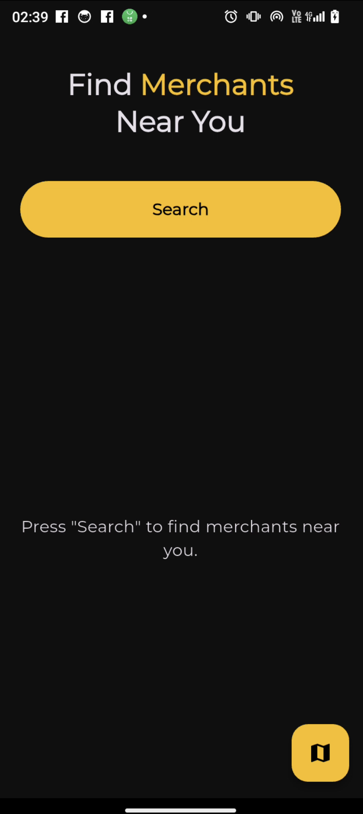
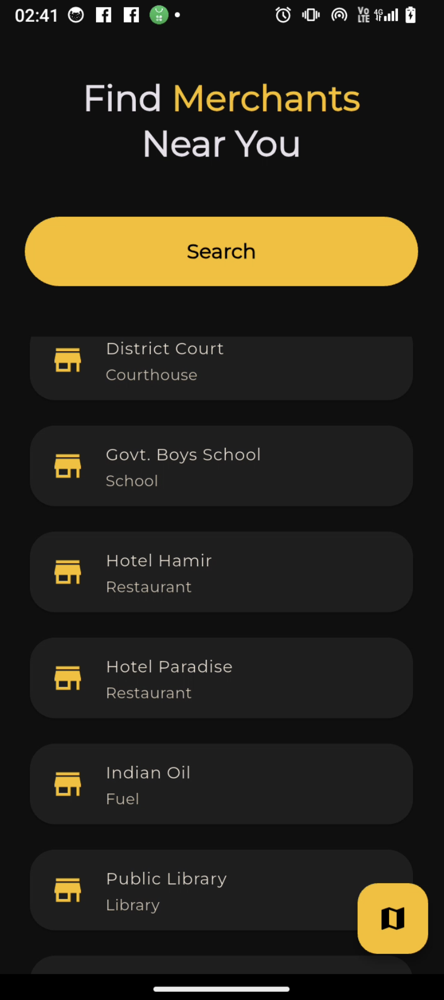
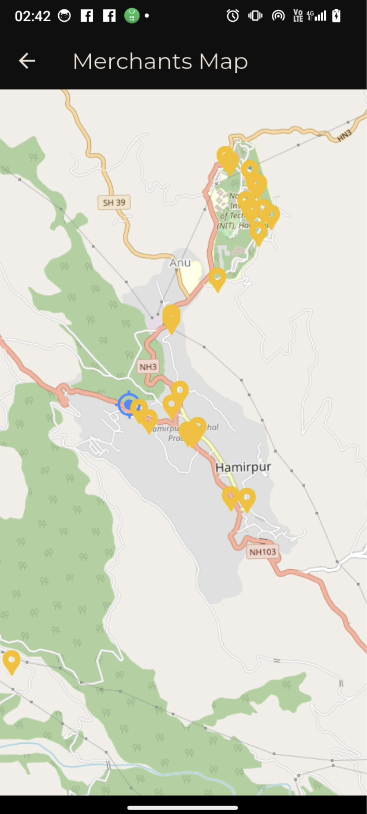

# Nearby Merchants
Nearby Merchants is a Flutter-based mobile application developed as a submission for the hackathon organized by FusionCards. The challenge was to build an app that retrieves the user's current location and displays a list of nearby merchants.

## Features
-Displays user's current location on an OpenStreetMap map. 

-Dynamically plots merchants as markers based on realtime location of the user. 

-Live data stream using Overpass API. 

-Fullscreen map view. 

-Clean dark themed UI inspired by the UI/UX of the [FUSIONCARD.IN](https://www.fusioncards.in) website. 


## Installation
1. Clone the repository. 

`git clone https://github.com/pranjalsharmahp/Nearby-Merchants.git`. 

2. Install dependencies. 

`flutter pub get`. 

3. Run the app. 

`flutter run`

## Folder Structure
```lib/
├── main.dart                            # App entry point and theme setup
│
├── views/                               # Map-related logic and UI
│   ├── map_view.dart                    # Full-screen map with user + merchant pins
│   ├── home_view.dart                   # lists all the merchants using the widget merchant card
│
├── merchants/                           # Merchant data logic
│   ├── merchants_lister.dart            # Fetch and filter nearby merchants (Overpass logic)
│
├── widgets/                             # Reusable UI components
│   ├── merchant_card.dart               # Merchant item UI card for list/sheet
|
├── location_service/                               # Shared utilities and services
│   ├── location_service.dart            # Location permission + current position logic
```

## Dependencies 
| Dependency           | Purpose                                               |
|----------------------|-------------------------------------------------------|
| geolocator           | Get user's current location.                          |
| flutter_map          | Display map and merchants using OpenStreetMap.        |
| google_fonts         | Use custom fonts from Google Fonts.                   |
| url_launcher         | Launch URLs in external apps (like maps, browsers).   |
| flutter_overpass     | Fetch the merchants around us                         |
| latlong2             | Represents latitude and longitude values.             |

## How to use
1. Launch the app on your device
2. Grant location permission
3. Wait for few seconds while the app fetches and filters the nearby merchants
4. Explore:  

    -Scrollable Merchant list. 

    -Pins on the map for each merchant. 

## Screenshots
**Initial Screen**. 



**List of Merchants Screen**. 



**Map View**. 



## Author
**Pranjal Sharma**. 

-GitHub: [pranjalsharmahp](https://github.com/pranjalsharmahp). 

-LinkedIn: [Pranjal](https://www.linkedin.com/in/pranjal-sharma-3182ab22b/)